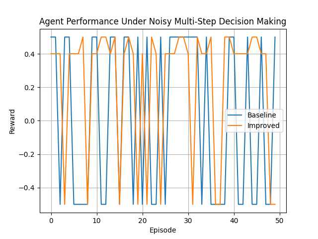

title: RobustOps
colorFrom: blue
colorTo: green
sdk: docker
app_file: inference.py
pinned: false

# RobustOps: Multi-Step Email Classification Environment

> A minimal evaluation environment for testing robustness, uncertainty handling, and self-correction in AI agents.

---

## Overview

RobustOps is an evaluation environment for testing how AI agents behave under **uncertainty, noise, and multi-step decision constraints** in phishing detection tasks.

The goal is to evaluate whether agents can **recover from incorrect decisions and adapt** under noisy and ambiguous conditions.

Unlike traditional single-step classification tasks, this environment introduces:

* Noisy signals
* Ambiguous inputs
* Multi-step decision making
* Self-correction opportunities

---

## Problem

Real-world phishing detection is not binary. Signals are often:

* Incomplete
* Conflicting
* Misleading

Agents must:

1. Make an initial classification
2. Revise decisions when new signals appear
3. Handle uncertainty responsibly

---

## Environment Design

Each episode simulates an email classification scenario.

### Signals

* urgent_tone
* suspicious_domain
* spoofed_sender
* benign_context (noise)

### Actions

* `classify`: initial decision (spam / not_spam)
* `revise`: update decision
* `flag_uncertain`: defer decision

### Rewards

| Action Outcome         | Reward |
| ---------------------- | ------ |
| Correct classification | +0.5   |
| Wrong classification   | -0.2   |
| Successful revision    | +1.0   |
| Failed revision        | -0.3   |
| Uncertainty flag       | +0.2   |

---

## Example Run

```
Initial: Signals: ['urgent_tone']
Step 1: classify → wrong → reward -0.2
Step 2: revise → correct → reward +1.0
Final Score: 1.0
```

---

## Failure Case

```
Initial: Signals: ['benign_context']
Step 1: classify → not_spam → reward -0.2
Step 2: revise → still not_spam → reward -0.3
Final Score: 0.0
```

---

## Evaluation

We compare two agents:

* **Baseline Agent**: makes immediate classification without revision
* **Uncertainty-Aware Agent**: revises decisions based on feedback

Experiments were conducted over **50 episodes with stochastic signal generation**.

### Results

| Agent             | Avg Reward |
| ----------------- | ---------- |
| Baseline          | -0.04      |
| Uncertainty-Aware | 0.20       |

The Uncertainty-Aware Agent consistently outperforms the baseline by leveraging revision and uncertainty handling strategies.

---

### Performance Visualization



---

## How to Run

Install dependencies:

```bash
pip install -r requirements.txt
```

Run evaluation:

```bash
python3 evaluate_agents.py
```

Run baseline only:

```bash
python3 run_baseline.py
```

---

## Run with Docker

Build the image:

```bash
docker build -t robustops .
```

Run the container:

```bash
docker run robustops
```

---

## Why This Matters

This environment evaluates:

* Robustness to noisy inputs
* Ability to self-correct
* Decision-making under uncertainty
* Multi-step reasoning

These are critical gaps in current LLM evaluation benchmarks.

---

## Key Takeaway

Robust performance in real-world settings is not just about making correct predictions, but about knowing when **not** to make a decision.

Agents that handle uncertainty and revise decisions outperform those that rely on immediate classification under noisy conditions.

---

## Future Work

* Adversarial signal injection
* Longer multi-step reasoning chains
* Real-world dataset integration

---
